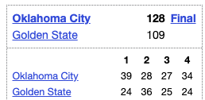

There are two types of APIs (NBA Data, Parse basketball-reference)

# i. NBA Data 🏀 🧬

Current Data:
- Box Scores
  - 2021-2023 (2 seasons)

Possible Data:
- More seasons
- Player Stats
- Team/Game Stats

Currently doing this in free time every now and then, if you want me to continue (why does this sound like a threat) send me what you want in the description: venmo @Sahir-B 🍟 (last 4 phone digits 4836) 🫶🏽

To get all Lakers sorted totals in 2022 road losses:
```javascript
const sortedLakers = bref.getSeasonScores(2022)
.filter(boxScore => {
    return
        boxScore.roadTeam === 'LA Lakers' &&
        boxScore.winningTeam !== 'LA Lakers';
}).sort((boxScoreA, boxScoreB) => {
    return
        boxScoreA.roadTeamTotal - boxScoreB.roadTeamTotal;
}).map(boxScore => {
    return {
        gameDate: boxScore.gameDate,
        roadTeamTotal: boxScore.roadTeamTotal,
    }
});

console.log(sortedLakers);

// -- result --
[
  { gameDate: '2022-12-28', roadTeamTotal: 98 },
  { gameDate: '2022-10-26', roadTeamTotal: 99 },
  { gameDate: '2022-11-9', roadTeamTotal: 101 },
  { gameDate: '2022-10-28', roadTeamTotal: 102 },
  { gameDate: '2022-12-6', roadTeamTotal: 102 },
  { gameDate: '2022-12-19', roadTeamTotal: 104 },
  { gameDate: '2023-1-30', roadTeamTotal: 104 },
  { gameDate: '2022-11-22', roadTeamTotal: 105 },
  { gameDate: '2022-10-18', roadTeamTotal: 109 },
  { gameDate: '2023-1-9', roadTeamTotal: 109 },
  { gameDate: '2023-2-28', roadTeamTotal: 109 },
  { gameDate: '2023-3-15', roadTeamTotal: 110 },
  { gameDate: '2022-12-7', roadTeamTotal: 113 },
  { gameDate: '2022-12-25', roadTeamTotal: 115 },
  { gameDate: '2023-2-13', roadTeamTotal: 115 },
  { gameDate: '2022-11-7', roadTeamTotal: 116 },
  { gameDate: '2023-4-5', roadTeamTotal: 118 },
  { gameDate: '2022-12-21', roadTeamTotal: 120 },
  { gameDate: '2023-1-28', roadTeamTotal: 121 },
  { gameDate: '2022-12-9', roadTeamTotal: 122 },
  { gameDate: '2023-2-4', roadTeamTotal: 126 }
]
```

To get all scores for one/more teams:
```javascript
const lakersThunder = bref.getSeasonScoresSimple(2022, ['LA Lakers', 'Oklahoma City']);

console.log(lakersThunder.length);
console.log(lakersThunder[0]);

// -- result --
160
{
  gameDate: '2021-10-19',
  roadTeam: 'Golden State',
  homeTeam: 'LA Lakers',
  ...
  winningTeamScore: 121,
  losingTeamScore: 114
}
```

Data Model
```javascript
BoxScore: {
    gameDate: string,
    numExtraPeriods: number,
    roadTeam: string,
    homeTeam: string,
    gameTotal: number,
    roadTeamTotal: number,
    homeTeamTotal: number,
    winningTeam: string,
    losingTeam: string,
    winningTeamScore: number,
    losingTeamScore: number,
    periodBreakdown: []PeriodBreakdown
}

PeriodBreakdown: {
    period: number,
    roadTotal: number,
    homeTotal: number
}
```

Functions
```javascript
getSeasonScores(season_start_year) => BoxScore[]

getSeasonScoresSimple(season_start_year, teams_to_include) => BoxScore[]

season_start_year: number

teams_to_include?: string[] // exclude to get all teams
```

# ii. Parse basketball-reference.com
Parse basketball-reference.com for NBA data! 🏀 🧬

This was used to create the NBA Data! 🙏🏽

Currently supports getting game totals. For example, if we're interested in 2023-11-16
https://www.basketball-reference.com/boxscores/?month=11&day=16&year=2023



```javascript
const bref = require('@sahirb/basketball-reference')
bref.getBoxScores({
    year: 2023,
    month: 11,
    day: 16
});

// -- result --
{
  gameDate: '2023-11-16',
  numExtraPeriods: 0,
  periodBreakdown: [
    { period: 1, roadTotal: 39, homeTotal: 24 },
    { period: 2, roadTotal: 28, homeTotal: 36 },
    { period: 3, roadTotal: 27, homeTotal: 25 },
    { period: 4, roadTotal: 34, homeTotal: 24 }
  ],
  roadTeam: 'Oklahoma City',
  homeTeam: 'Golden State',
  gameTotal: 237,
  roadTeamTotal: 128,
  homeTeamTotal: 109,
  winningTeam: 'Oklahoma City',
  losingTeam: 'Golden State',
  winningTeamScore: 128,
  losingTeamScore: 109
},
{
    ... // NJ Nets at Miami
}
```

Data Model
```javascript
BoxScore: {
    gameDate: string,
    numExtraPeriods: number,
    roadTeam: string,
    homeTeam: string,
    gameTotal: number,
    roadTeamTotal: number,
    homeTeamTotal: number,
    winningTeam: string,
    losingTeam: string,
    winningTeamScore: number,
    losingTeamScore: number,
    periodBreakdown: []PeriodBreakdown
}

PeriodBreakdown: {
    period: number,
    roadTotal: number,
    homeTotal: number
}
```

Functions
```javascript
getBoxScores(date) => Promise<BoxScore[]>

date: {
    year: number,
    month: number,
    day: number
}
```
```javascript
getBoxScoresForDates(last_game_date, num_additional_days, file_path, box_score_transformation) => Promise<BoxScore[]>

last_game_date: {
    year: number,
    month: number,
    day: number
}

num_additional_days: number // additional days going back from last_game_date

file_path?: string // (optional) local file to save result to

box_score_transformation?: (BoxScore) => void // (optional) callback applied to each BoxScore in the response (and in the local file if file_path specified)
```

How to use - simple
```javascript
const bref = require('@sahirb/basketball-reference')

const date = {
    year: 2023,
    month: 11,
    day: 16
};

bref.getBoxScores(date).then(boxScores => {
    boxScores.forEach(boxScore => console.log(boxScore));
});

```

How to use - advanced (save multiple days to file with new 'feeling' column)
```javascript
const bref = require('@sahirb/basketball-reference')

const last_game_date = {
    year: 2023,
    month: 11,
    day: 16
};

const num_additional_days = 2;

const local_file_path = "/Users/boghani/basketball-reference-js-box-score/output_json.txt";

const box_score_transformation = (boxScore) => {
    let feeling = 'snooze fest';

    if (boxScore.gameTotal > 220) {
        feeling = 'wow points and stuff';

        if (boxScore.winningTeamScore - boxScore.losingTeamScore < 10) {
            feeling = 'be still my heart <4';
        }
    }

    boxScore.feeling = feeling;
};

bref.getBoxScoresForDates(last_game_date, num_additional_days, local_file_path, box_score_transformation).then(boxScores => {
    boxScores.forEach(boxScore => console.log(boxScore));
});

```
